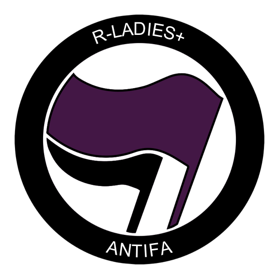

# Code to create Rladies ANTIFA hexsticker

You will need to have installed and loaded the following libraries:

``` r
# libraries
library(hexSticker)
library(png)
library(grid)
library(plotrix)
library(grDevices)
library(magick)
```

In addition, load the `antifa()` function

``` r
source("fct/antifa.R")
```

Here, we define the dark purple from RLadies

``` r
#colors
rladies <- "#562457" #rladies purple, for a lighter option use: #88398A both from rladies color palete
```

For the ANTIFA flag we use the public domain icon from [The Noun
Project](https://thenounproject.com/search/?q=antifa&i=1245689). The
function `antifa()` creates the flag with the desired title.

``` r
#antifa image
antifa(x = "¡liibre!", text.size = 2.3)
```

<!-- -->

``` r
antifa(x = "biólogxs", text.size = 2.3)
```

<!-- -->

``` r
antifa(x = "r-ladies+", bg.col = rladies, text.size = 2.3)
```

<!-- -->

To create the hexSticker the image should be on disk (`save = TRUE`). We
have seen that the text size is dependent on the OS. If it is too big or
too small, use the argument `text.size` to control it.

``` r
antifa1 <- antifa(save = TRUE)
sticker(antifa1,
        package = "",
        asp = 0.85,
        s_x = 1, s_y = 1,
        s_width = 1, s_height = 1,
        p_size = 13,
        h_fill = rladies, #bg color for hexsticker
        h_color = "black",
        filename = "hexsticker/rladies_antifa_red.png")
```


